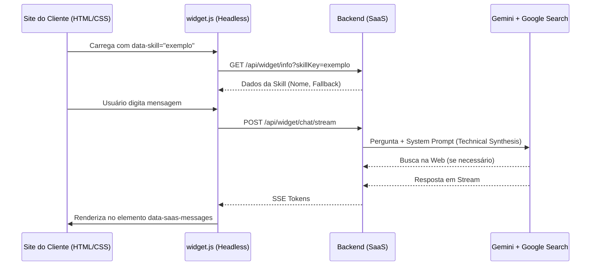

# MODEL — Arquitetura da Plataforma SaaS Headless

Este documento descreve a arquitetura final do projeto **MODEL**, uma solução de Chatbot SaaS "Headless" (sem interface fixa), onde o backend provê a inteligência e a lógica, enquanto o cliente define 100% da identidade visual.

---

## 1. Visão Geral: O Conceito "Headless"

Diferente de widgets tradicionais que injetam um iframe ou um layout fixo, o MODEL funciona como um **DOM Scanner**:
- O cliente importa um script único (`widget.js`).
- O script busca marcações `data-saas-*` no HTML existente do cliente.
- O script atrela eventos e lógica de streaming a esses elementos.
- **Resultado**: Versatilidade total. O mesmo backend serve desde um chat estilo Discord (Robótica) até um terminal industrial (Mecânica) ou um blog aconchegante (Culinária).

---

## 2. Pilares da Arquitetura (Monorepo)

1.  **`packages/core`**: O "Cérebro Determinístico". Contém o schema Zod das skills e o `DomainGate`.
2.  **`backend`**: O "Orquestrador".
    - Gerencia o carregamento de skills dinâmicas via JSON.
    - Conecta-se à API do Gemini com **Web Grounding (Google Search)** ativado.
    - Provê endpoints de streaming (SSE) para o widget.
3.  **`skills/`**: O "Conhecimento". Pasta contendo arquivos `.skill.json` que definem a persona, o tom e a área de especialização de cada bot.

---

## 3. Inteligência e Web Grounding

O sistema utiliza o provedor **Gemini** com ferramentas de busca ativa:
- **Busca Técnica**: Se a IA não possui a informação exata (ex: pinagem de um componente novo), ela realiza uma busca no Google em tempo real.
- **Síntese Técnica**: O `PromptBuilder` força a IA a responder em tópicos, priorizando dados técnicos e eliminando enrolações introdutórias.
- **Validação de Domínio Híbrida**: 
    - O `DomainGate` (código) bloqueia ataques e temas proibidos.
    - O LLM (cognitivo) decide se a pergunta é "humana" (saudações) ou se deve ser recusada por estar fora de área.

---

## 4. Fluxo de Execução

---

## 5. Exemplos Implementados

Para demonstrar a versatilidade, o projeto inclui:
- **RoboKids (Porta 3000)**: Estilo Discord/Neon.
- **Mão na Massa (Porta 3001)**: Estilo blog culinário, acolhedor e visualmente rico.
- **IronWorks (Porta 3002)**: Estilo industrial, brutalista e focado em diagnósticos.

---

## 6. Próximos Passos (Roadmap)
- **Multi-tenancy Físico**: Isolamento de banco de dados por cliente.
- **Painel Administrativo**: Interface para o cliente editar sua `.skill.json` via Web.
- **Analytics**: Dashboard de volume de mensagens e tópicos mais pesquisados na web.
