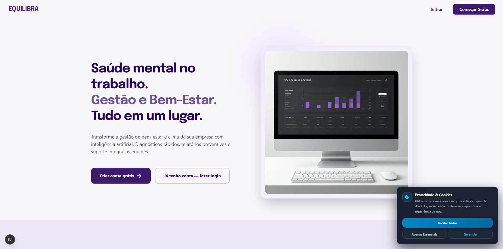
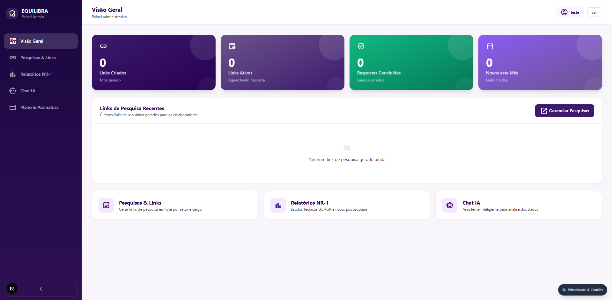
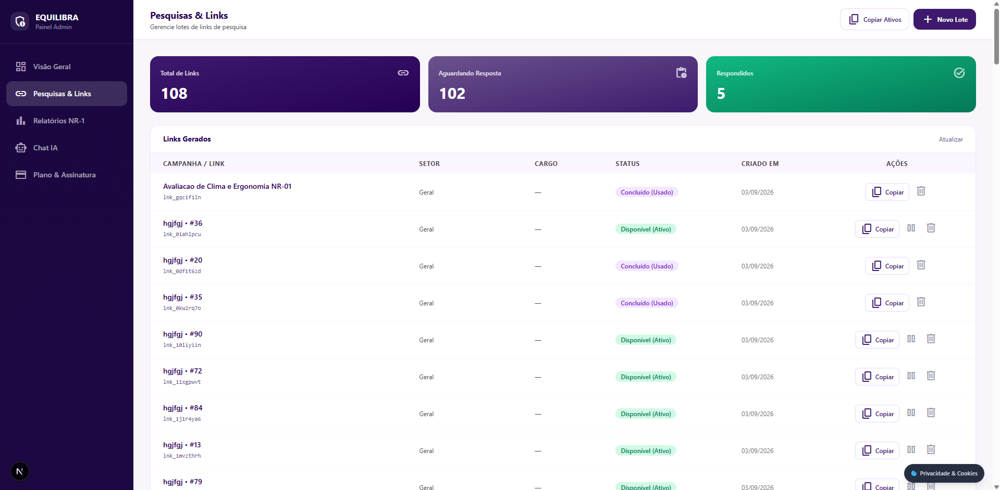
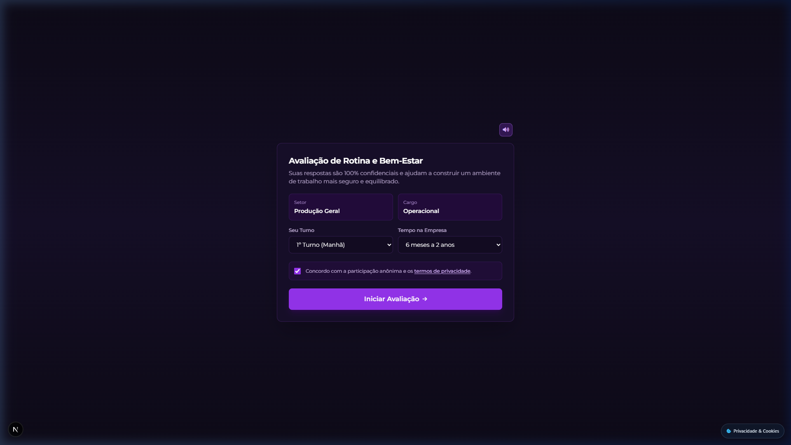
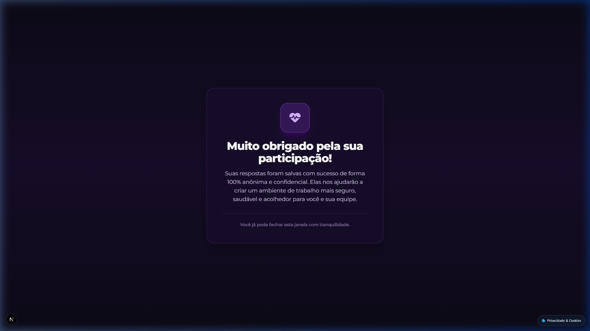
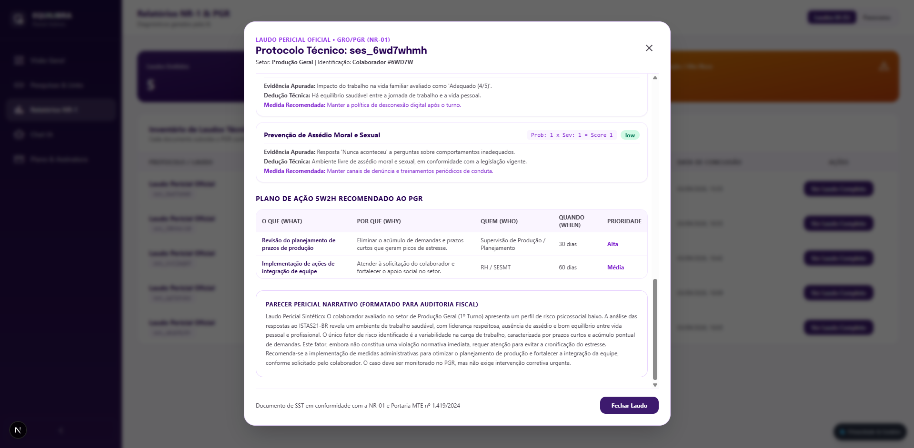

<h1 align="center">Equilibra AI SaaS | Gestão de Riscos Psicossociais & NR-01</h1>

<p align="center">
  
  
  
  
  
  
</p>

> **Official repository for the integrated Psychosocial Risk Assessment, Clinical AI Pericial Diagnosis, and Regulatory Compliance System** of the platform **Equilibra** (Tailored for NR-01, eSocial, and ISTAS21-BR).

---

<div align="center">
  
</div>

---

## System Architecture

The platform operates using a **high-performance modern full-stack architecture**, separating data orchestration, real-time audio synthesis, and pericial clinical intelligence:

* **The Core & Frontend (Next.js 16 + TypeScript + Tailwind CSS):** Delivers fluid, accessible interfaces with motion micro-animations, server-side auth proxying, and responsive widgets (binary cards, 0-10 rating scales, and contextual choice chips).
* **The Intelligence & Audio Engine (Groq AI + Edge Neural TTS):** Powers the adaptive conversational interview using low-latency LLMs (`qwen/qwen3.8-27b`) with strict token economics, paired with zero-cost Brazilian Portuguese neural voice streaming (`pt-BR-FranciscaNeural`) across any browser.
* **The Persistence Layer (MySQL Relational DB + JWT Auth):** Manages relational data integrity, campaign batches, multi-tenant administrative roles, anonymous employee sessions, and audit logs compliant with LGPD.

---

## Visual Demonstration & System Walkthrough

### 1. Landing Page & Unified Auth
Modern entry point with instant cookie-based session verification, smooth scroll, and dark-mode aesthetics.

<div align="center">
  
</div>

---

### 2. Admin Dashboard (Risk Management & Real-Time KPIs)
Centralized overview of company risk levels, sector compliance, completion rates, and quick action cards.

<div align="center">
  
</div>

---

### 3. Surveys & Batch Link Generator
Instant creation of survey campaigns organized by sector and job role, generating single-use anonymous links with live status tracking.

<div align="center">
  
</div>

---

### 4. Employee Onboarding (LGPD & Confidentiality)
Frictionless onboarding ensuring worker privacy, anonymous participation, and formal consent under LGPD (Law nº 13.709/2018).

<div align="center">
  
</div>

---

### 5. Adaptive AI Conversational Interview
Empathetic, voice-synchronized interview with real-time typewriter effects, snappy transitions (0.5s post-audio), and automated discovery protocols for reported workplace distress.

<div align="center">
  
</div>

---

### 6. Official Pericial Technical Report & 5W2H Action Plan
Automated clinical diagnosis across the 7 ISTAS21-BR dimensions, probability × severity risk matrix, actionable 5W2H plans, and narrative text formatted for labor inspection audits.

<div align="center">
  
</div>

---

## Main Features

* **Real-Time Neural Speech (Zero-Cost):** Universal streaming of Brazilian Portuguese neural voices directly to any browser without expensive third-party voice APIs.
* **Economical Pericial AI:** Fast, targeted reasoning engine with token capping for responsive survey interactions and comprehensive technical reports.
* **Strict LGPD Compliance:** End-to-end anonymity, bcrypt password hashing, encrypted JWT sessions, and zero worker identifying markers in clinical risk outputs.
* **Actionable 5W2H Integration:** Automatic generation of corrective and preventive measures ready for insertion into company PGR/GRO documentation.

<br>
---

## How to Run the Project

### 1. Requirements
* Node.js 18+ installed
* MySQL Server 8.0+ running locally (default port `3306`)
* Groq Cloud API Key ([console.groq.com](https://console.groq.com))

### 2. Installation
Clone the repository and install all dependencies:

```bash
git clone https://github.com/NycolasQG-DEV/equilibra-project.git
cd equilibra-project
npm install
```

### 3. Configuration (`.env`)
Copy `.env.example` to `.env` and fill in your credentials:

```bash
cp .env.example .env
```

Review environment keys in `.env`:
* `DB_HOST = "localhost"`
* `DB_PORT = 3306`
* `DB_USER = "root"`
* `DB_PASSWORD = ""`
* `DB_NAME = "equilibradb"`
* `JWT_SECRET = "your_secure_jwt_secret_key_2026"`
* `GROQ_API_KEY = "gsk_your_groq_api_key_here"`
* `GROQ_MODEL = "qwen/qwen3.8-27b"`

### 4. Database Setup & Auto-Seeding
Run the initialization script to automatically create the database, tables, relational indexes, and the default demo administrator:

```bash
node setup-db.mjs
```

### 5. Start Application
With everything configured, start the development server:

```bash
npm run dev
```

Open [http://localhost:3000](http://localhost:3000) in your browser.

---

## Demo Credentials

| Role               | Email                      | Password     | Plan         |
|--------------------|----------------------------|--------------|--------------|
| `Administrator`    | `teste.teste@teste.teste`  | `testeteste` | Professional |

---

<div align="center">
  <i>Developed by Nycolas Queiroz Gimenez (NycolasQG-DEV).</i>
</div>
